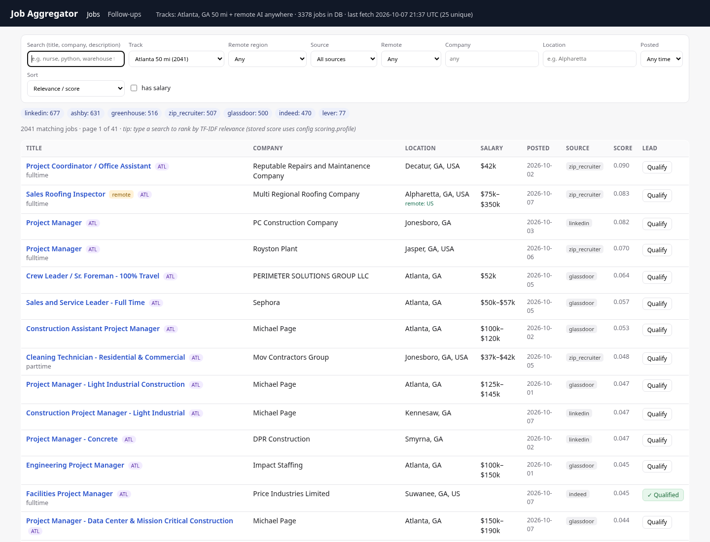

# job-aggregator

A small, fully open-source job aggregator. It pulls postings from:

| Source | How | Auth / cost |
|---|---|---|
| Indeed, LinkedIn, Google Jobs, ZipRecruiter, Glassdoor | [JobSpy](https://github.com/speedyapply/JobSpy) (`python-jobspy`) | none / free |
| Greenhouse boards | `https://boards-api.greenhouse.io/v1/boards/{slug}/jobs?content=true` | public API, free |
| Lever boards | `https://api.lever.co/v0/postings/{slug}?mode=json` | public API, free |
| Ashby boards | `https://api.ashbyhq.com/posting-api/job-board/{slug}?includeCompensation=true` | public API, free |

It normalizes everything into one SQLite `jobs` table, de-duplicates on
normalized *company + title + location*, scores each job against your
resume profile (TF-IDF), and serves a local search UI (FastAPI + htmx).
It also keeps a **3-touch follow-up email draft queue** for qualified leads. Nothing
is ever sent automatically (see [Follow-up emails](#follow-up-emails-draft-queue--never-auto-sends)).

Two search **tracks** run by default (every job is tagged with the track(s) it matched):

| Track | What | Sources |
|---|---|---|
| `atlanta` | **all job types within 50 miles of Atlanta, GA** | JobSpy (Atlanta, 50 mi, broad terms) + `companies.yaml` boards filtered to Atlanta-metro towns |
| `remote_ai` | **remote AI / ML / automation jobs located anywhere** (US, worldwide, EU, any country), incl. entry-level and non-engineering (AI trainer, data annotation, AI ops, sales, customer success) | `companies_ai.yaml` AI-company boards (every remote posting) + AI-titled remote postings on `companies.yaml` boards + JobSpy remote-only AI queries (Indeed US, LinkedIn Worldwide, ZipRecruiter) |

Remote jobs get a `remote_region` (US, Worldwide, Europe, UK, Canada, LATAM, APAC,
India, EMEA, Australia/NZ, Middle East/Africa, combinations like "US, Canada", or
"Unspecified" when the posting doesn't say).



## Quick start (your own Mac or Windows PC)

You need **Python 3.10+** ([python.org/downloads](https://www.python.org/downloads/);
on Windows tick *"Add python.exe to PATH"* in the installer) and **git**.

**macOS / Linux** (Terminal):

```bash
git clone https://github.com/Gtownrter77/job-aggregator.git
cd job-aggregator
python3 -m venv .venv
source .venv/bin/activate
pip install -r requirements.txt
cp config.local.example.yaml config.local.yaml   # then edit: your name, phone, email
python -m aggregator fetch --no-jobspy           # fast first fetch (~1 min, ATS boards only)
python -m aggregator fetch                       # full fetch incl. Indeed/LinkedIn/... (slower)
python -m aggregator serve                       # open http://localhost:8765
```

**Windows** (PowerShell):

```powershell
git clone https://github.com/Gtownrter77/job-aggregator.git
cd job-aggregator
py -m venv .venv
.\.venv\Scripts\Activate.ps1      # if blocked: Set-ExecutionPolicy -Scope CurrentUser RemoteSigned
pip install -r requirements.txt
copy config.local.example.yaml config.local.yaml   # then edit it in Notepad
python -m aggregator fetch --no-jobspy
python -m aggregator fetch
python -m aggregator serve
```

Then browse to **http://localhost:8765** (stop the server with Ctrl+C). Next time,
just `cd job-aggregator`, activate the venv again, and run `fetch` / `serve`.

Python 3.10+ works (tested on 3.13).

### Your private settings (`config.local.yaml`)

`config.yaml` is committed and only holds placeholders (`Your Name`,
`555-555-5555`, `you@example.com`). Put your real details in **`config.local.yaml`**
(gitignored; start from `config.local.example.yaml`). It is merged on top of
`config.yaml` at startup, so it only needs the keys you change, e.g.
`followups.applicant_name/phone/email`, `applicant.headline/skills`, and
`metro.extra_towns` (appended to `metro.towns`). Point to a different file with
`AGGREGATOR_LOCAL_CONFIG=...`.

Never committed (see `.gitignore`): `config.local.yaml`, `.env`, `resumes/`,
`data/` and any `*.db`/`*.sqlite`, `logs/`, `.venv/`.

## Usage

```bash
python -m aggregator fetch                 # all tracks, all sources -> data/jobs.db
python -m aggregator fetch --track remote_ai            # one track only
python -m aggregator fetch --track remote_ai --no-jobspy  # AI-company boards only (~30 s)
python -m aggregator fetch --no-jobspy     # only Greenhouse/Lever/Ashby (fast, very reliable)
python -m aggregator fetch --only indeed,greenhouse
python -m aggregator fetch --companies     # also print per-company counts
python -m aggregator serve                 # UI at http://localhost:8765
python -m aggregator serve --port 9000
python -m aggregator verify-slugs          # HTTP-check every company slug
python -m aggregator verify-slugs --prune  # ...and drop failing ones from companies.yaml
python -m aggregator verify-slugs --track remote_ai   # check companies_ai.yaml
python -m aggregator rescore               # recompute scores (after editing the profile)
python -m aggregator stats                 # DB counts per source/track/region + last run

# follow-ups (drafts only; see below)
python -m aggregator qualify <job_id> [<job_id> ...] [--start YYYY-MM-DD] [--show]
python -m aggregator followups [--all]     # list the draft queue
python -m aggregator send-approved --dry-run   # what WOULD be sent (nothing is sent)
python -m aggregator send-approved         # sends approved+due drafts; refuses unless enabled + SMTP set
```

Background server helpers: `scripts/serve-bg.sh`, `scripts/stop-server.sh`
(logs in `logs/server.log`).

Use a different config file with `-c path/to/config.yaml` or `AGGREGATOR_CONFIG=...`.

### UI

* Search box: matches title, company and description (all words must match).
* Filters: **track** (Atlanta 50 mi / Remote AI anywhere), **remote region**, source,
  remote / on-site, company (autocomplete), location text, posted-within, has-salary.
  Each row shows its track chip(s) and, for remote jobs, `remote: <region>`.
* Sort: newest, relevance/score, salary, company.
  *Relevance* with a search query = TF-IDF similarity of each match to your query.
  Without a query it uses the stored score = similarity to your resume profile.
* **Qualify** button on every row → creates the lead + 3 follow-up drafts.
  **Follow-ups** tab → the approval queue.
* Every title links out to the original posting. Green source chips = direct employer ATS;
  a posting seen on several sources shows all of them.
* JSON API: `/api/jobs?q=nurse&source=indeed&track=atlanta&region=US&sort=date&page=1`,
  `/api/followups`, `/api/stats`, `/healthz`.

## Configuration (`config.yaml`)

Everything is commented in the file. The common changes:

```yaml
search:
  location: "Atlanta, GA"     # where JobSpy searches
  distance_miles: 50
  roles: []                   # [] = all job types; e.g. ["software engineer", "registered nurse"]
  exclude_keywords: []        # e.g. ["intern", "clearance"]  (matched against titles)
  remote_only: false
  include_remote: false       # ATS sources: also keep remote postings outside the metro
  hours_old: 168              # JobSpy: only last 7 days

jobspy:
  sites: {indeed: true, linkedin: true, google: true, zip_recruiter: true, glassdoor: true}
  search_terms: ["full time", "part time", "manager", ...]   # used when roles is empty
  results_wanted: 40          # per site per search term
```

* **Roles** set → postings are kept only if the title contains one of them, and
  the roles become the JobSpy search terms.
* **Roles empty** → no role filter; JobSpy runs the broad `search_terms` list so
  "all jobs" still returns a wide, non-empty slice of each board.
* **Location for ATS sources**: Greenhouse/Lever/Ashby return a company's
  *global* postings, so they are filtered locally by the `metro` section — a list
  of Atlanta-area towns (towns that also exist in other states, e.g. Marietta,
  Decatur, Gainesville, Roswell, Duluth, only match when followed by `GA`/`Georgia`).
  To retarget another city, change `search.location` and replace `metro.towns`.
* JobSpy boards are already filtered by distance server-side; set
  `jobspy.apply_metro_filter: true` to also require a metro town.
* **Scoring**: every job is scored by TF-IDF cosine similarity to
  `scoring.resume_file` (`resumes/profile_text.txt`, built from the resumes, see
  [Resume profile](#resume-profile)) plus optional free text in `scoring.profile`.
  Run `python -m aggregator rescore` after changing either.
  `scoring.method: embeddings` uses sentence-transformers if installed
  (`pip install sentence-transformers`, ~1 GB with CPU torch); otherwise TF-IDF.
* **LLM extraction (optional)**: `llm.enabled: true` + a local
  [Ollama](https://ollama.com) server → each new job is sent to the local model and
  structured fields (seniority, skills, salary, summary) land in `jobs.llm_json`.
  If Ollama isn't reachable it is skipped and the fetch summary says so. The hook
  lives in `aggregator/llm.py` (`extract()`), easy to swap for another local runner.

### Tracks (`tracks:` in config.yaml)

```yaml
tracks:
  atlanta:   {enabled: true}        # uses search/jobspy/ats/metro above
  remote_ai:
    enabled: true
    remote_only: true
    companies_file: companies_ai.yaml   # AI companies: every REMOTE posting kept
    scan_main_companies: true           # + AI-titled remote postings from companies.yaml
    keywords: ["AI", "ML", "LLM", "machine learning", "prompt engineer", "AI trainer",
               "data annotation", "AI operations", "AI product", "automation", ...]
    description_min_hits: 0             # 0 = title match only (descriptions say "AI" everywhere)
    jobspy:
      sites: {indeed: true, linkedin: true, zip_recruiter: true, glassdoor: false, google: false}
      locations: {indeed: "United States", linkedin: "Worldwide", zip_recruiter: "United States"}
      search_terms: ["artificial intelligence", "machine learning", "LLM", "prompt engineer",
                     "AI operations", "AI trainer", "data annotation", "AI product manager",
                     "automation specialist", "AI solutions", "AI sales", "AI customer success",
                     "AI entry level"]
```

* "Remote" for ATS postings: Ashby `workplaceType: Remote` (Ashby's `isRemote` is also
  true for hybrid roles, so hybrid-only roles are excluded unless a location says
  Remote), Lever `workplaceType: remote`, or a location string containing
  remote/anywhere/distributed. JobSpy queries use each board's own remote-only filter.
* Track tags on ATS postings are re-evaluated every run (a full board is read);
  JobSpy tags accumulate. A board posting that stops matching a track loses that tag
  and is deleted when it matches none (qualified leads are never deleted).
* `remote_region` is parsed from the location strings (plus Ashby secondary
  locations / Lever allLocations), falling back to explicit "work from anywhere"
  wording in the description; otherwise "Unspecified".

## Adding companies

`companies.yaml` holds the Atlanta-track ATS seed list and `companies_ai.yaml` the
AI-company list for `remote_ai` (both use `greenhouse`, `lever`, `ashby` keys).

1. Find the company's careers page. The slug is in the URL:
   * `boards.greenhouse.io/<slug>` or `job-boards.greenhouse.io/<slug>` → greenhouse
   * `jobs.lever.co/<slug>` → lever
   * `jobs.ashbyhq.com/<slug>` → ashby
2. Add `- {slug: <slug>, name: <Display Name>}` under the right key.
3. `python -m aggregator verify-slugs` (or `--track remote_ai`); must print `OK ... HTTP 200`.
   Also open the board once: slugs can belong to a different company with the same
   name (e.g. Ashby `flock` is a London insurer, `runway` a finance startup, not Runway ML).

Quick manual check: `curl -s -o /dev/null -w '%{http_code}\n' "https://boards-api.greenhouse.io/v1/boards/<slug>/jobs"`.

## Data model

One normalized table, plain SQL that ports to PostgreSQL (TEXT/REAL/INTEGER,
ISO-8601 timestamps, `INSERT ... ON CONFLICT (dedupe_hash) DO UPDATE`):

`jobs(id, source, source_job_id, board, company, title, location, remote, salary_min,
salary_max, salary_currency, salary_interval, job_type, url, description,
posted_at, fetched_at, first_seen_at, seen_on, score, llm_json, dedupe_hash UNIQUE,
track, remote_region)`

plus `leads(job_id, qualified_at, qualified_by, contact_name, contact_email,
contact_source, status, replied_at, updated_at)` and
`followups(id, job_id, touch 1-3, scheduled_for, status draft|approved|sent|skipped|replied,
subject, body, edited, generator, created_at, updated_at, approved_at, sent_at, send_error)`.
New columns are added to older DBs automatically on startup.

* `dedupe_hash = sha1(norm(company) | norm(title) | norm(location))` — lower-cased,
  punctuation/legal suffixes (Inc, LLC…) stripped, parentheticals removed from titles,
  "Georgia"→"GA", country tokens removed. Re-fetching never creates duplicates; the
  same posting from two sources collapses into one row (`seen_on` lists both,
  ATS/direct-employer URL and the longer description win).
* `fetch_log` records every query/board (status, counts, error); `runs` stores
  each fetch summary (JSON).

To move to Postgres: swap `sqlite3` for `psycopg`, change `?` placeholders to `%s`,
and optionally make `remote` BOOLEAN / timestamps TIMESTAMPTZ.

## Follow-up emails (draft queue, never auto-sends)

**Safety rule: nothing in this project sends email on its own.** Fetching,
qualifying, auto-qualifying, editing and approving only write rows to the
`followups` table. The only code path that can send is
`python -m aggregator send-approved`, run by hand, and it refuses unless **all** of these are true:

1. `followups.sending_enabled: true` in config.yaml (default **false**);
2. `SMTP_HOST`, `SMTP_USER`, `SMTP_PASS`, `FROM_ADDR` are set in the environment
   (copy `.env.example` to `.env`, which is gitignored; nothing is configured by default);
3. the draft's status is `approved` (a human clicked Approve), its date is due, the
   lead is still active (not replied), and the lead has a contact email.

`send-approved --dry-run` lists what would go out without connecting to anything.

### Flow

1. **Qualify** a job (UI button on the Jobs page, or `python -m aggregator qualify <job_id>`).
   Optional: `followups.auto_qualify_score: 0.25` qualifies every job at or above that
   score after each fetch (default `null` = off). Auto-qualify also only creates drafts.
2. Three drafts are created on the schedule `followups.schedule_days: [0, 3, 10]`
   (Day 0, Day 3, Day 10 from the qualify date). With `skip_weekends: true` a date
   that lands on Sat/Sun moves to Monday (e.g. qualified Wed → Wed, Mon, Mon).
3. **Contact**: if the posting text itself contains a recruiter/hiring email it is
   used (`contact_from_posting`, ignoring no-reply/privacy/EEO addresses). Otherwise the
   lead is flagged **needs contact**: type a name and email you found yourself. The
   tool never scrapes, guesses or pattern-generates personal emails.
4. **Follow-ups** page (`/followups`): drafts due today and overdue, each with editable
   subject/body, **Save**, **Approve** (blocked until there's a contact email and no
   `[[EDIT …]]` placeholders remain), **Back to draft**, **Skip**, and **Mark replied**
   (stops the remaining touches for that lead). Upcoming drafts and history are listed below.

### How the drafts are written

* With a local [Ollama](https://ollama.com) model (`llm.enabled: true`,
  `followups.use_llm: true`, default model `llama3.2:3b`, ~2 GB RAM, CPU-only is fine,
  ~45 s per job for all 3 touches) each touch is written by the model from the posting
  and the applicant's **corroborated** facts (`compose.applicant_facts`: `use`
  accomplishments without a `confirm` flag, credentials found in most resume versions).
  Every touch is validated: 35-125 words, a subject line, no `[[...]]`/bracket
  placeholders, no banned clichés, no unconfirmed claims (`FORBIDDEN_CLAIMS`: PMP, LEED,
  Ohio University / bachelor's, "supervised 14 PMs", revenue figures ...), no claimed AI
  experience on AI roles, no invented prior contact, and **every number must appear in
  the facts or the posting**. A touch that fails twice falls back to its template
  version; if Ollama is down the whole sequence uses templates. Greeting, sign-off and
  the signature (name/phone/email from `config.local.yaml`) are added in code, so the
  signature is always exact. The `generator` column says `ollama:<model>` or `templates`.
* Without Ollama a template engine composes them from `followup_templates.yaml`.
* Each touch has its own angle: (1) warm intro tying one specific posting detail to the
  applicant, (2) value-add nudge with a true accomplishment plus one light line,
  (3) gracious, witty last check-in. Each has 6 subject lines, 6 bodies and (touches
  2–3) a pool of clean humor lines, picked deterministically per job so different jobs
  get different combinations and a job's drafts don't change between renders.
* Personalization comes from the posting (a quoted sentence from the description,
  key skills, city) and from the applicant facts: `followups.applicant_name/phone/email`
  (signature) and `applicant.headline/skills/profile_file`. The accomplishment used
  in touch 2 is the resume item whose tags best match the posting. For roles outside
  the resume's field the wording is "transferable" / "career move", never claimed experience.
* Lint: < ~120 words, banned clichés ("just circling back", "touching base",
  "hope this finds you well", …), distinct subjects. Placeholders `{name} {company}
  {title} {applicant_name}` etc. are documented at the top of the templates file.
* Hand-edited drafts are never re-rendered.

## Unattended runs (local AI, no paid APIs)

`scripts/auto_run.sh` (= `python -m aggregator auto` plus housekeeping) runs from cron at
**7:19, 11:19 and 16:19 ET on weekdays**:

1. starts Ollama (`scripts/ollama-bg.sh`) and the UI (`scripts/serve-bg.sh`) if they're down;
2. fetches each enabled track separately (a crash in one track or source doesn't stop the run);
3. rescores, then auto-qualifies up to `auto.max_qualify_per_run` (5) strong NEW matches:
   first seen in the last `auto.new_within_hours` (72 h), not already a lead, score >=
   `auto.min_score` (0.04 ~ top 0.5% of postings), fit = direct, de-duplicated (same company
   + near-identical title), at most 2 per company per run;
4. their 3 follow-ups are written by the local model as **drafts** (approve in the UI;
   nothing is ever sent, approved or scheduled automatically);
5. writes `logs/digest-YYYY-MM-DD-HHMM.md` and `logs/latest-digest.md`: new-job counts,
   top 5 matches with links and a short Fit/Gap note from the model, newly qualified jobs,
   follow-ups due, leads blocked on a contact email, and any source errors.

`python -m aggregator redraft <job_id>...` rewrites a lead's unedited drafts with the current
model (hand-edited/approved drafts are untouched). A lock (`flock`) prevents overlapping runs. Logs: `logs/auto_run.log`, `logs/ollama.log`.
Crontab: `19 7,11,16 * * 1-5 .../scripts/auto_run.sh` and `@reboot .../scripts/boot.sh`.

## Resume profile

`resumes/` is **gitignored**: it holds your own resumes and the profile built from
them, and never leaves your machine. Layout:

* `raw/`: your resume files (.docx / .pdf / .txt);
* `text/`: one text file per **unique** resume (exact duplicates removed by name+size
  and by identical normalized text); `manifest.json` maps every file to its text and duplicates;
* `profile.json` / `profile.md`: one merged profile with every role, employer,
  date range, skill, software, certification, education entry and accomplishment, each
  listing the resume files it appears in and how many versions contain it. Items found
  in only a few versions or contradicting the majority are marked **confirm before using**
  and are never used in emails;
* `profile_text.txt`: the corroborated items as plain text, used for job scoring.

Extract text after adding resumes: `python scripts/extract_resumes.py`. The simplest
profile is just `resumes/profile_text.txt` (paste your resume text) — that alone drives
scoring; then run `python -m aggregator rescore`. `profile.json` is optional; drafts use
its `accomplishments` list (`[{"use": "led a 12-person crew ...", "tags": "crew safety"}]`,
items with `"confirm": true` are skipped). The script that generated the original
author's profile (`scripts/build_profile.py`) contains personal resume data and is not
part of this repo. Without any resume files the app still works (scores are 0 until
you add a profile or set `scoring.profile`).

## Scheduling

### cron (macOS / Linux)

```bash
crontab -e
# every 6 hours; flock prevents overlapping runs (Linux; on macOS install flock or drop it)
0 */6 * * * /path/to/job-aggregator/scripts/cron-fetch.sh
```

On Windows use Task Scheduler to run
`<repo>\.venv\Scripts\python.exe -m aggregator fetch` with the repo as the start folder.

Output goes to `logs/fetch.log`. The UI reads the same DB, so it picks up new
jobs without restarting.

### GitHub Actions

`.github/workflows/fetch-jobs.yml` runs `python -m aggregator fetch` **only on
manual dispatch** (Actions tab → fetch-jobs → Run workflow). It needs no secrets,
never sends email, never commits/pushes anything, and uploads the resulting
`jobs.db` as a 7-day artifact. The schedule is disabled on purpose; see the comment
in the file to re-enable it. Note: job boards (LinkedIn, Indeed, Glassdoor…) rate-limit
datacenter IPs harder than home connections, so expect more JobSpy failures on
hosted runners than locally; the ATS sources are unaffected.

## Known limitations

* **Google Jobs (via JobSpy) currently returns nothing**: google.com now serves a
  JavaScript-only interstitial to non-browser clients, which JobSpy's HTML parser
  can't read. The site is logged as failed and skipped after 2 attempts. Leave it
  enabled to pick up a future JobSpy fix, or set `google: false`.
* JobSpy scrapes public pages; boards can rate-limit (HTTP 429) or block IPs at any
  time. Every site is isolated: failures are logged in the fetch summary and in
  `fetch_log`, and the rest continue. `jobspy.proxies` accepts free/self-hosted proxies.
* LinkedIn, Glassdoor and ZipRecruiter results have no description unless
  `linkedin_fetch_description` / `fetch_description` are enabled (slower, more requests).
* "All job types" is approximated by a set of broad search terms × `results_wanted`
  per board; no board exposes its full Atlanta inventory. Add terms or raise
  `results_wanted` for more coverage.
* ATS location filtering is text-based (town list), not geocoded. Postings listed
  only as "United States" or "Remote" are excluded from the Atlanta track unless
  `include_remote: true` (they can still land in `remote_ai`).
* `remote_ai` keyword matching is on titles, so AI companies' boards are where the
  non-engineering AI roles come from; a "Customer Success Manager" at a non-AI company
  that happens to sell AI features is not included.
* `remote_region` is text-based. Greenhouse "Remote" postings sometimes only state the
  region in the description; those show "Unspecified".
* JobSpy's Indeed and ZipRecruiter are per-country (US here); worldwide coverage comes
  from LinkedIn "Worldwide" and the ATS boards.
* Dedupe is exact-match on normalized strings: "Sr. Software Engineer" vs
  "Senior Software Engineer" stay separate rows.
* Greenhouse salaries come from regex on the description (Greenhouse's structured pay
  ranges need per-job requests); Lever/Ashby use structured fields when present.
* ATS postings that disappear from a board are pruned on the next successful fetch of
  that board (qualified leads are kept). JobSpy rows are not pruned; filter by "Posted".
* No email is sent unless you enable it and run `send-approved` yourself; there is no
  reply detection, so use **Mark replied**.
